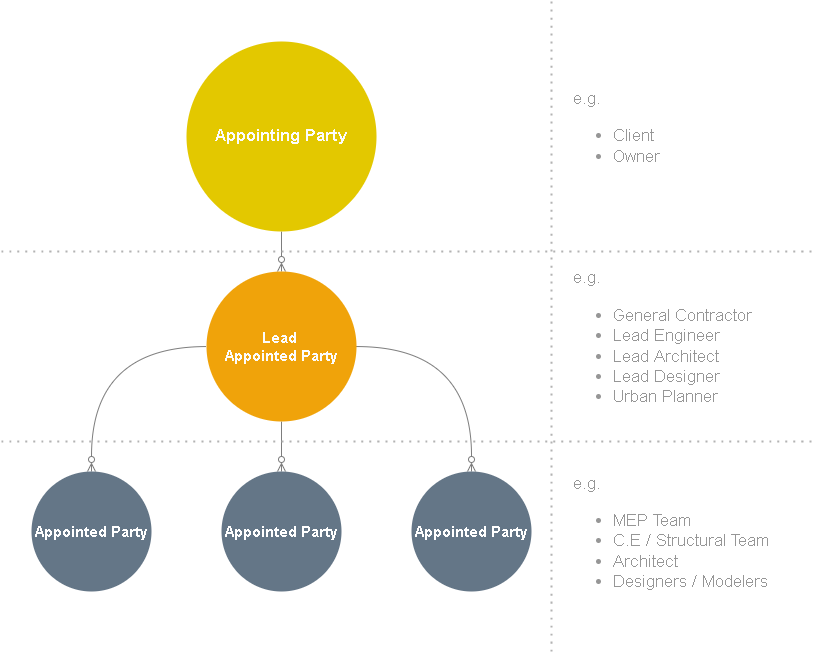

# 01-gitgud-BIM-Learn-ISO-19650-Part-1

Archive Now: No

Category: gitgud-BIM

Date Created: May 1, 2022 4:38 PM

Last Edited Time: May 2, 2022 7:58 PM

Priority: Priority: High 🔥

Status: Work in Progress
 
 

# To-do

Read ISO-19650

- [ ]  **Part 1 - Concepts & Principles**
    - [x]  Who participates
    - [x]  8 General Steps
    - [ ]  The Information Delivery Cycle
    - [ ]  Information Requirements
    - [ ]  Responsibility Matrices
    - [ ]  Collaborative Information Environment
        - [ ]  CDE (Common Data Environment)
    - [ ]  Use of Metadata
    - [ ]  Organization of Information
    - [ ]  Naming Standards

## The goal is to understand the BIM Framework.

*Framework = an essential structure to support a working system.*

---

## What is ISO-19650?

- It outlines the concept and principles of BIM.
- A framework for an efficient project delivery.
- A defined request and creation of information needed by the client.
- The ISO-19650 is applicable to all assets inside the project.
- A Global Standard for BIM Management.
- The WHAT, WHERE, WHEN, HOW of Information management during the delivery phase of assets.

## THE WHO?

1. **Appointing Party**
    1. The one who will receive the information at the end.
    2. e.g. Owner, Client.
    3. But not limited to letter b’s categorization.
    
2. **Lead Appointed Party**
    1. The one, group, team, org that won the bidding of the owner’s project.
    2. Could be a single entity, could be multiple.
    3. The direct connection between the owner and the “provider” of information.
    
3. **Appointed Party**
    1. The team led by the Lead Appointed party.
    2. The provider of information.
    3. The delivery team(s), task team(s).

Figure 1.0

1. **Type of Teams**
    1. Project Team
        1. Every one who is involved.
    2. Delivery Team
        1. The Lead Appointed & Its Tasks team(s).
            1. e.g. General Contractor → Sub contractors.
            2. e.g. Lead Engineer → MEP Modelers.
    3. Tasks Team
        1. An individual / Group who are responsible to a certain information models.
            1. e.g. Modelers.
        

---

## 8 GENERAL STEPS OF BIM

Information Management during the delivery phase of assets.

1. **Assessment and Needs**
    1. Owners will determine what BIM services they need for their project.
    
2. **Initiation/Invitation to Tender**
    1. Based on what the owner needs, they will now send out a bidding request.

3. **Tender Response**
    1. Based on what the Invitation to Tender details is, we write out a proposal on how are we going to approach the requirements.
    
4. **Appointment**
    1. Once we, or a specific BIM company is selected, the company will now prepare a detailed timeline and milestones to accomplished the requirement of the project, which then will be announced to the owner and the team.
    
5. **Mobilization**
    1. The lead appointed party (the one who wins the bidding), will now delegate a detailed tasks to its organization.
    2. and appoint and internal team which will be doing the specific tasks as required.
    
6. **Collaborative Production and Information**
    1. the appointed team must and should collaborate within its own layer of structured working environment.
        1. Manager → Modeler → Checker → Revisions → Approval → Archiving. 
        
7. **Information Model Delivery**
    1. The Appointing Party (a.k.a Owner) will review the published information models if it qualifies based on the asking set of requirements.
    2. The owner will then decide if the Information Models were approved or rejected.
    
8. **Project Close-Out & Asset Information Model (AIM) Aggregation**
    1. Once the assets are approved, and all the required set of requirements are met.
    2. The Information will now be then archived and aggregated into the ***asset information model***, for the on going operation and maintenance of the assets.
    

---

---

&nbsp;

---

## **Overview of The Information Delivery Cycle**

   - ***1ST*** - THE APPOINTING PARTY (client, owner, others)
      - Will Produce a list(s) or statement(s) of need, stating an assurance of information requirements.
      - Will define how the concepts and principles of infomration management are going to be implemented and lists of the benefits to be expected.
      - Will confirms the types of information and request a clarification on how the "different types" of information will be structured and be exchanged.
      - IT IS IMPORTANT FOR THE CLIENT (APPOINTING PARTY) TO EXPLAIN THE PRINCIPAL REASONS WHY BIM IS REQUIRED. As it will greatly help give an additional context to the project delivery team(s) later on.

&nbsp;

  - ***2ND*** - Prospective LEAD PARTY (contractor, designer, architect, others.)
    - Will respond to the Appointing Party's Information requirements through their (pre-appointment) BIM execution plan, which includes their list(s) or statement(s) of capability and capacity to apply the ISO 19650 series.

&nbsp;

-   ***3RD*** - Appointment
    -   The Appointing Party (client) will consider the BIM Execution Plan 

---

 
 

## **PIM (Project Information Model) // *The Specific Requirements***

- A specific Model Information required by the Appointing Party (Owner)
- Could be in a form of: 3D Models, databases, spreadsheets and other documentation materials.

&nbsp;

## **AIM (Asset Information Model) // *The Overall Requirements***

- The Final Output of the BIM Process.
- Provides all information required to perform the AEC Operations.
- AIM can include: Graphical Models, non-graphical data, necessary documentations.
    - unnecessary data = put to achieved.

&nbsp;

---

---
Sources: 

[UK BIM Framework – BIM Standards, Guides & Resources](https://www.ukbimframework.org/resources/)

To Study / Good finds while researching:

[Probability of Winning the Tender When Proposing Using BIM Strategy: A Case Study in Saudi Arabia](https://www.mdpi.com/2075-5309/11/7/306/pdf?version=1626683377)